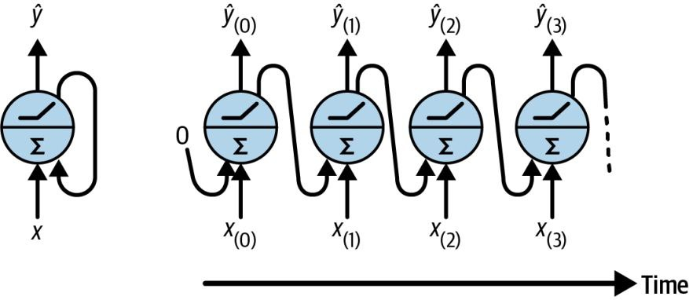

# Processing Sequences using RNNs and CNNs

## RNN
RNNs can work on sequences of arbitrary lengths, rather than on fixed-sized inputs.

RNNs have two main difficulties:
1. **Unstable gradients**, which can be alleviated using varous techniques, including recurrent dropout and recurrent layer normalization.
2. **A (very) limited short-term memory**, which can be extended using LSTM and GRU cells.

- For small sequences, a regular dense network can do the trick.
- For very long sequences, convolutional neural networks can actually work quite well too.

### Recurrent Neurons and Layers

A recurrent neuron (left) unrolled through time (right)
