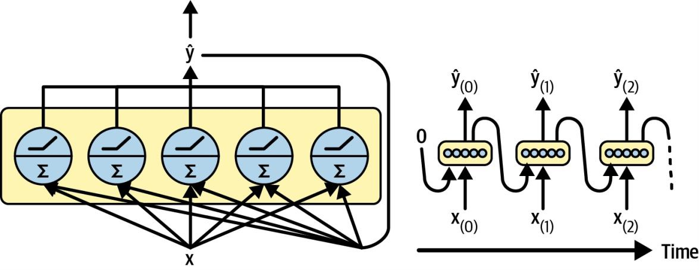
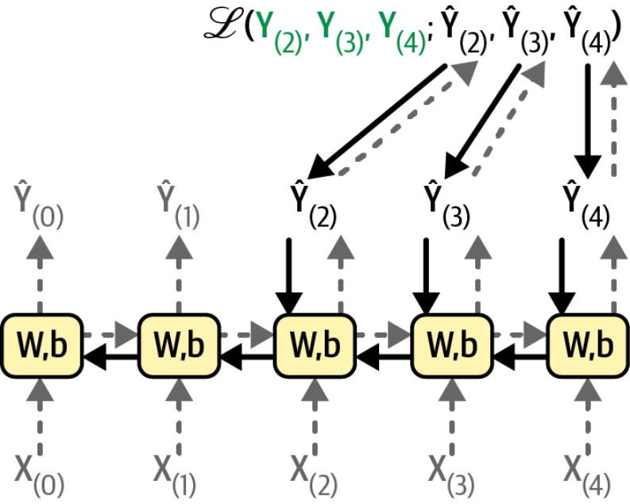
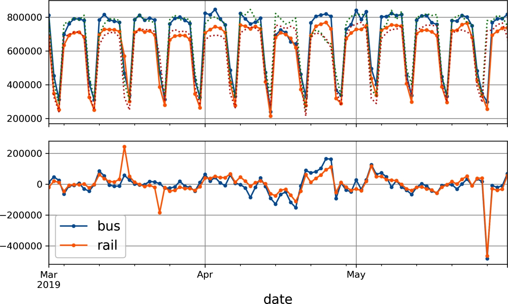

# Processing Sequences using RNNs and CNNs

## RNN
RNNs can work on sequences of arbitrary lengths, rather than on fixed-sized inputs.

RNNs have two main difficulties:
1. **Unstable gradients**, which can be alleviated using varous techniques, including recurrent dropout and recurrent layer normalization.
2. **A (very) limited short-term memory**, which can be extended using LSTM and GRU cells.

- For small sequences, a regular dense network can do the trick.
- For very long sequences, convolutional neural networks can actually work quite well too.

### Recurrent Neurons and Layers

A recurrent neuron (left) unrolled through time (right)

A layer of recurrent neurons (left) unrolled through time (right)

### Memory Cells 
Since the output of a recurrent neuron at time step t is a function of all the inputs from previous time steps, you could say it has a form of memory.

A single recurrent neuron or a layer of recurrent neurons, is a very basic cell, capable of learning only short patterns (typically about 10 steps long, but this varies depending on the task).

h(t) = f(x(t), h(t-1))

In the case of the basic cells, we have discussed so far, the output is just equal to the state.

### Input and Output Sequences
1. sequence-to-sequence network: forecast time series
2. sequence-to-vector network: ignore all outputs except for the last one. feed the network a sequence of words and the network would output a sentiment score
3. vector-to-sequence network: caption for an image
4. encoder-decoder: a sequence-to-vector network (encoder) followed by a vector-to-sequence network (decoder). In translating a sentence works much better than trying to translate on the fly  with a single sequence to sequence RNN. The last words of a squence can affect the first words of the translation.

Sequence-to-sequence (top left), sequence-to-vector (top right), vector-tosequence
(bottom left), and encoder–decoder (bottom right) networks

### Training RNNs

Backpropagation through time

### Forecasting a Time Series
naive forecasting: simply copying a past value to make our forecast. Naive forecasting is often a great baseline, and it can even be tricky to beat in some cases.

When a time series is correlated with a lagged version of itself, we say that the time series is autocorrelated.

