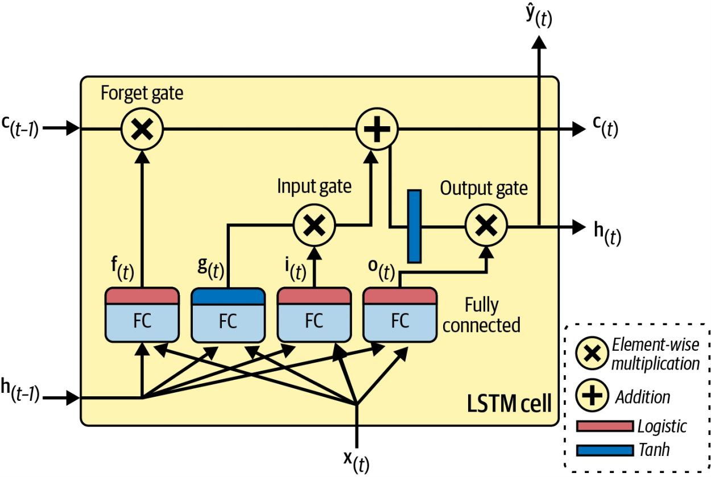

# Processing Sequences using RNNs and CNNs

## RNN
RNNs can work on sequences of arbitrary lengths, rather than on fixed-sized inputs.

RNNs have two main difficulties:
1. **Unstable gradients**, which can be alleviated using varous techniques, including recurrent dropout and recurrent layer normalization.
2. **A (very) limited short-term memory**, which can be extended using LSTM and GRU cells.

- For small sequences, a regular dense network can do the trick.
- For very long sequences, convolutional neural networks can actually work quite well too.

### Recurrent Neurons and Layers

A recurrent neuron (left) unrolled through time (right)

A layer of recurrent neurons (left) unrolled through time (right)

### Memory Cells 
Since the output of a recurrent neuron at time step t is a function of all the inputs from previous time steps, you could say it has a form of memory.

A single recurrent neuron or a layer of recurrent neurons, is a very basic cell, capable of learning only short patterns (typically about 10 steps long, but this varies depending on the task).

h(t) = f(x(t), h(t-1))

In the case of the basic cells, we have discussed so far, the output is just equal to the state.

### Input and Output Sequences
1. sequence-to-sequence network: forecast time series
2. sequence-to-vector network: ignore all outputs except for the last one. feed the network a sequence of words and the network would output a sentiment score
3. vector-to-sequence network: caption for an image
4. encoder-decoder: a sequence-to-vector network (encoder) followed by a vector-to-sequence network (decoder). In translating a sentence works much better than trying to translate on the fly  with a single sequence to sequence RNN. The last words of a squence can affect the first words of the translation.

Sequence-to-sequence (top left), sequence-to-vector (top right), vector-tosequence
(bottom left), and encoder–decoder (bottom right) networks

### Training RNNs

Backpropagation through time

### Forecasting a Time Series
naive forecasting: simply copying a past value to make our forecast. Naive forecasting is often a great baseline, and it can even be tricky to beat in some cases.

When a time series is correlated with a lagged version of itself, we say that the time series is autocorrelated.

Time series overlaid with 7-day lagged time series (top), and difference between t and t-7 (bottom)

Differencing is a common technique used to remove trend and seasonality from a time series: it's easier to study a **stationary** time series, meaning one whose statistical properties remain constant over time, without any seasonality or trends. Once you are able to make accurate forecasts on the differenced time series, it's easy to turn them into forecasts for the actual time series by just adding back the past values that were previously subtracted.

### The ARMA Model Family
Autoregressive moving average (ARMA): Coumputes its forecasts using a simple weighted sum of lagged values and corrects these forecasts by adding a moving average.

The first sum is the autoregressive component. The second sum is the moving average component.

The model assumes the time series is stationary. Using differencing over a single time step will produce an approximation of the derivative of the time series (slope of the series) (eliminate any linear trend).

If the original time series has a quadratic trend, then a single round of differencing will not be enough. Running d consecutive rounds of differencing computes an approximation of the dth order derivative of the time series, so it will eliminate polynomial trends up to degree d. This hyperparameter d is called the order of integration.

Autoregressive integrated moving average (ARIMA) runs d rounds of differencing to make the time series more stationary, after applying ARMA it adds back the terms that were subtracted by differencing.

Seasonal ARIMA (SARIMA): models the time series in the same way as ARIMA, but it additionally models a seasonal component for a given frequency (e.g., weekly).

There are principled approaches to selecting good hyperparameters, based on analyzing the autocorrelation function (ACF) and partial autocorrelation function (PACF_, or minimizing the AIC or BIC metrics to penalize models that use too many parameters.

Since gradient descent expects the instances in the training set to be independent and identically distributed, we must set the argument shuffle=True to shuffle the training windows.

### Forecasting Multivariate Time Series
Using a single model for multiple related tasks often results in better performance than using a separate model for each task, since features learned for one task may be useful for the other tasks, and also because having to perform well across multiple tasks prevents the model from overfitting (it's a form of regularization).

### Handling Long Sequences
1. takes forever to train
2. gradually forgets the first inputs
3. training my be unstable

### Fighting the Unstable Gradients Problem
To alleviate:
1. good parameter initialization
2. faster optimizers
3. dropout

Nonsaturating activation functions (e.g., ReLU) may not help as much here (may actually lead the RNN to be even more unstable). Suppose gradient descent updates the weights in a way that increases the outputs slightly at the first time step. Because the same weights are used at every time step (Weight Sharing), the outputs at the second time step may also be slightly increased and those at third, and so on until the outputs explode--and a nonsaturating activation function does not prevent that.

To reduce this risk:
1. smaller learning rate
2. use a saturating activation function (like hyperbolic tangent (default))

In much the same way, the gradients themselves can explode. If you notice that training is unstable, you may want to monitor the size of gradients and perhaps use gradient clipping.

| Aspect | Batch Normalization | Layer Normalization |
|--------|---------------------|---------------------|
|Normalization Scope| Across batch (dimension-wise) | Across features (within each sample)|
|Batch Size Dependence| Yes | No|
|Best Use Case| Convolutional and dense networks | RNNs, transformers and small or variable batch sizes|

It is technically possible to add a BN layer to a memory cell, so that it will be applied at each time step. However, the same BN layer will be used at each time step, with the same parameters, regardless of the actual scale and offset of the inputs and hidden state. This does not yield good results.

One advantage of layer normalization is that it can compute the required statistics on the fly, at each time step, independently for each instance. This also means that it behaves the same way during training and testing (as opposed to BN), and it does not need to use exponential moving averages to estimate the feature statistics across all instances in the training set, like BN does.

Exponential moving averages is a technique used to maintain a running average of batch statistics. The purpose is to estimate these statistics during training, so they can be used later during inference.

When forecasting time series, it is useful to have some error bars along with your predictions. One approach is MC (Monte Carlo) dropout: use recurrent_dropout during training, then keep dropout active at inference time (model(X, training=True)). Repeat this several times, then compute the mean and standard deviation of these predictions for each time step.

### Tackling the Short-Term Memory Problem
#### LSTM cells
Long short-term memory:
1. converge faster
2. detect longer-term patterns

Its state is split into two vectors: h(t) (short-term state) and c(t) (long-term state).

An LSTM cell

f(t), i(t) and o(t) are gate controllers. Since they use the logistic activation function, the outputs range from 0 to 1. The gate controllers' outputs are fed to element-wise multiplication operations: if they output 0s they close the gate, and if they output 1s they open it:
- forget gate: which parts of the long-term state should be erased
- input gate: which parts of g(t) should be added to the long-term state
- output gate: which parts of the long-term state should be read and output at this time step, both to h(t) and to y(t)

#### GRU cells
Gated recurrent unit is a simplified version of the LSTM cell, seems to perform just as well.

#### Using 1D convolutional layers to process sequences
A 1D convolutional layer slides several kernels across a sequence, producing a 1D feature map per kernel. Each kernel will learn to detect a single very short sequential pattern (no longer than the kernel size). By shortening the sequences the convolutional layer may help the GRU layers detect longer patterns.

#### WaveNet

